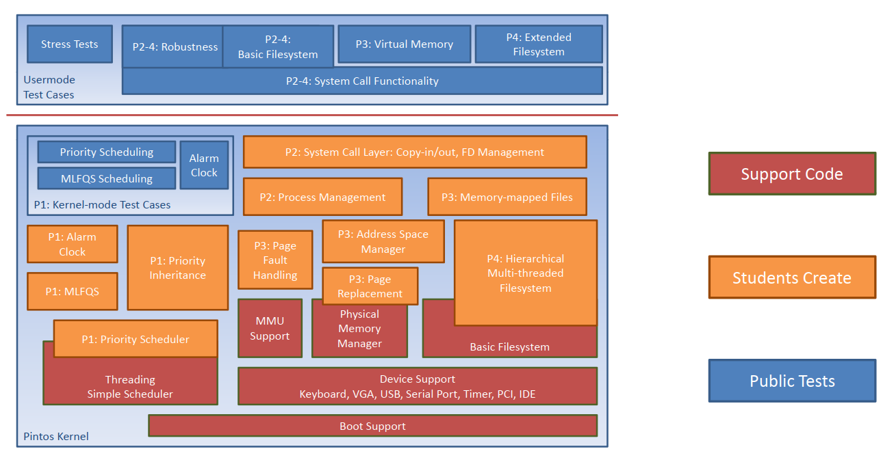

# Pintos

## About

PintOS is an open source instructional operating system kernel developed by Stanford University. PintOS provides complete documentation & modular projects to introduce students to the major concepts of operating systems development. The components of PintOS project is illustrated in the following figure.

The project is divided into four phases:

* P1: Threads
* P2: User Programs
* P3: Virtual Memory
* P4: File Systems

## Source Code

Source code is adopted from the open source project at [PintOS-OS](https://pintos-os.org/), we will try to keep this repository in sync with the official repository at [PintOS-OS Official Repository](https://pintos-os.org/cgi-bin/gitweb.cgi?p=pintos-anon;a=summary).

Last adopted commit details:

* Comment: random: Fix behavior of kernel option "-rs". master
* Date: Sat, 29 May 2021 19:05:19 +0000 (12:05 -0700)
* URL: [f685123e5f8e7c84648b2de810ba20e85b7d1504](https://pintos-os.org/cgi-bin/gitweb.cgi?p=pintos-anon;a=commit;h=f685123e5f8e7c84648b2de810ba20e85b7d1504)

To download the most recent code from [PintOS-OS](https://pintos-os.org/) directly, use the following [link](https://pintos-os.org/cgi-bin/gitweb.cgi?p=pintos-anon;a=snapshot;h=HEAD).

## Installation Guidelines

To install PintOS please use the guidelines listed at the [installation document](Installation.md).

## Project Documents

The following is a list of the documents to explain and document the project and its requirements.

1. [PintOS Official Document](guides/PintOS&#32;Official&#32;Document.pdf): The main official documentation and project requirements compiled from PintOS repository provided by Stanford University.
2. [CSCI 350 - PintOS Guide](guides/CSCI&#32;350&#32;-&#32;Pintos&#32;Guide.pdf): A simple read for PintOS code and its requirement provided from [University of Southern California OS Course](http://bits.usc.edu/cs350/).
3. [The Pintos Instructional Operating System Kernel (PintOS Paper)](guides/The&#32;Pintos&#32;Instructional&#32;Operating&#32;System&#32;Kernel.pdf): A good reading for instructors.
4. [The Pintos Instructional Operating System Kernel (PintOS Presentation)](guides/SIGCSE2009-Pintos.pdf): A good reading for instructors.

## Sessions' Videos

Here's a list of sessions I made (in Arabic) for Alexandria University, explaining PintOS & its phases requirements:

1. [Phase 1 Requirements](https://youtu.be/RLx_0nnEjaM)
2. [Phase 2 Requirements](https://youtu.be/bFUmvVgmbOs)
